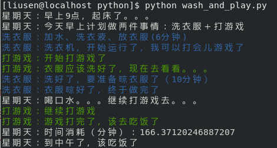

# Coroutine (1) 什么是协程

## 1、认知的边界

> 只要是人，都是依靠自己的**知识**与**认知**并且也被之束缚的生活着的，那就叫做现实，但是知识和认知是暧昧不清的东西，现实也许也只是镜花水月，人都是活在自己的执念中的，你不这么认为吗？——《火影忍者》宇智波鼬

> All people live relying on their knowledge and perception and are thus bound to them. Those boundaries are what they tend to accept as "Reality". However, knowledge and perception are both ambigous, so "Reality" could be nothing more than an illusion. People live trapped by their limited perception, do you see?

Reference: https://www.mangapanda.com/naruto/385/6

> 知识是普遍的事物规律，认识是主观的思维意识。  
> 知识是一种信息的“存量”，认知是一种获取信息的“过程”。  
> `ambiguous`: when you need to describe something that's open to more than one interpretation.


我的解读：

- （1）有些知识，是超出你已有知识的边界的。对于你知识边界之外的东西，是相信它，还是排斥它，还是心存敬畏。
- （2）即便是你亲身感知的事情，也存在多种不同的解读方式；而多种解读方式的结果，与你现有的知识和认知也未必是相一致的。


> 孔子穷乎陈蔡之间，藜羹不斟，七日不尝粒。昼寝，颜回索米，得而焚之，几熟。孔子望见颜回攫其甑中而食之。选间，食熟，谒孔子而进食，孔子佯装为不见之。孔子起曰：“今者梦见先君，食洁而后馈。”颜回对曰：“不可，向者煤炱入甑中，弃食不祥，回攫而饭之。”孔子叹曰：“所信者目也，而目犹不可信；所恃者心也，而心犹不足恃。弟子记之，知人固不易矣。”故知非难也，孔子之所以知人难也。


> 孔子在周游列国时，有段时间连饭都没得吃，还好有一天颜回弄回来一袋米，孔子让他做好后跟大家一起吃。饭煮好后，孔子却发现颜回自己先在里面拿了些饭出来吃了。他当时不作声，在大家都在一起的时候，教育起大家来：“求学除了要求知之外，还要学习尊师重道，在长辈还没吃饭的时候，如果自己先吃了，那是不礼貌的行为。”
> 颜回解释道：“老师你误会了，刚才我见饭里有些黑色的米饭，可能是柴火灰吹上去了，我又不敢浪费粮食，所以先把黑色的饭先吃了。”
> 孔子感叹：“亲眼所见的东西也不一定是你所想的那样呀，你们大家以为看事情，要先经过自己的调查和思考呀。”

## 2、Coroutine

- `routine`: 可以理解成一个function
- `subroutine`: sub + routine = sub function
- `coroutine`: co + routine = co(operative) function

### 2.1、星期天：洗衣服、打游戏

洗衣服：
- 加水、洗衣液、放衣服(6分钟)
- 洗衣机运行（30分钟）
- 晾衣服（10分钟）

打游戏：（150分钟）

```python
import time
import greenlet

def wash_clothes():
    print("洗衣服：加水、洗衣液、放衣服(6分钟)")
    time.sleep(0.06)
    print("洗衣服：洗衣机，开始运行了，我可以打会儿游戏了")
    gr_play.switch()
    print("洗衣服：洗好了，要准备晾衣服了（10分钟）")
    time.sleep(0.10)
    print("洗衣服：衣服晾好了，可以接着打游戏了")
    gr_play.switch()

def play_computer_game():
    print("打游戏：开始打游戏了")
    time.sleep(0.30)
    print("打游戏：衣服应该洗好了，现在去看看。。。")
    gr_wash.switch()
    print("打游戏：继续打游戏")
    time.sleep(1.20)
    print("打游戏：游戏打完了，该去吃饭了")
    gr_main.switch()

gr_main = greenlet.getcurrent()
gr_wash = greenlet.greenlet(wash_clothes)
gr_play = greenlet.greenlet(play_computer_game)

print("星期天：早上9点，起床了。。。")
print("星期天：今天早上计划做两件事情：洗衣服＋打游戏")
start_time = time.time()
gr_wash.switch()
end_time = time.time()
print("星期天：时间消耗（分钟）：%s" % ((end_time-start_time)*100))
print("星期天：到中午了，该吃饭了")

```

pip install termcolor

termcolor: https://pypi.org/project/termcolor/

```python
import time
import greenlet
from termcolor import cprint

def wash_clothes():
    cprint("洗衣服：加水、洗衣液、放衣服(6分钟)","blue")
    time.sleep(0.06)
    cprint("洗衣服：洗衣机，开始运行了，我可以打会儿游戏了","blue")
    gr_play.switch()
    cprint("洗衣服：洗好了，要准备晾衣服了（10分钟）","blue")
    time.sleep(0.10)
    cprint("洗衣服：衣服晾好了，终于做完了","blue")

def play_computer_game():
    cprint("打游戏：开始打游戏了","green")
    time.sleep(0.30)
    cprint("打游戏：衣服应该洗好了，现在去看看。。。","green")
    gr_wash.switch()
    cprint("打游戏：继续打游戏","green")
    time.sleep(1.20)
    cprint("打游戏：游戏打完了，该去吃饭了","green")

gr_main = greenlet.getcurrent()
gr_wash = greenlet.greenlet(wash_clothes)
gr_play = greenlet.greenlet(play_computer_game)

cprint("星期天：早上9点，起床了。。。","white")
cprint("星期天：今天早上计划做两件事情：洗衣服＋打游戏","white")
start_time = time.time()
gr_wash.switch()
cprint("星期天：喝口水。。。继续打游戏去。。。","white")
gr_play.switch()
end_time = time.time()
cprint("星期天：时间消耗（分钟）：%s" % ((end_time-start_time)*100),"white")
cprint("星期天：到中午了，该吃饭了","white")

```



### 2.2、小明沏茶

问题：妈妈让小明给客人烧水沏茶．洗开水壶要用1分钟，烧开水要用15分钟，洗茶壶要用1分钟，洗茶杯要用1分钟，拿茶叶要用2分钟．小明估算了一下，完成这些工作要花20分钟．为了使客人早点喝上茶，按你认为最合理的安排，多少分钟就能沏茶了？

回答：先洗开水壶，接着烧开水，烧上水以后，小明需要等15分钟，在这段时间里，他可以洗茶壶，洗茶杯，拿茶叶，水开了就沏茶，这样只用16分钟．

```python
import time

def clean_kettle():
    print("Clean Kettle Start")
    time.sleep(0.01)
    print("Clean Kettle Over")
    return

def boil_water():
    print("Boil Water Start")
    time.sleep(0.15)
    print("Boil Water End")

def wash_teapot():
    print("Wash Teapot Start")
    time.sleep(0.01)
    print("Wash Teapot End")

def wash_cup():
    print("Wash Cup Start")
    time.sleep(0.01)
    print("Wash Cup End")

def take_tea():
    print("Take tea Start")
    time.sleep(0.02)
    print("Take tea End")

def xiaoming_synchronous():
    clean_kettle()
    boil_water()
    wash_teapot()
    wash_cup()
    take_tea()

from gevent import monkey
monkey.patch_all()

import gevent
def xiaoming_asynchronous():
    clean_kettle()
    def teapot_cup_tea():
        wash_teapot()
        wash_cup()
        take_tea()

    tasks = []
    tasks.append(gevent.spawn(boil_water))
    tasks.append(gevent.spawn(teapot_cup_tea))
    gevent.joinall(tasks)

def cost_time(func):
    start_time = time.time()
    func()
    end_time = time.time()
    print("Cost time: %s" % (end_time - start_time))
    return

if __name__ == '__main__':
    print("Synchronous:")
    cost_time(xiaoming_synchronous)
    print("="*66)
    print("Asynchronous:")
    cost_time(xiaoming_asynchronous)
    

```

## 3、Coroutines vs Subroutines

Reference: https://www.hackingnote.com/en/versus/subroutine-vs-coroutine/

Coroutines are generalizations of the normal "subroutines". The main difference is that each invocation of a subroutine has the same starting point and the same end point all the time, while a coroutine has multiple entry points and multiple pathways. 

Coroutine:

- Coroutines is a more generalized form of subroutines.
- can be entered, exited, and resumed at many different points.
- can pause execution and yield control back to the caller or another coroutine. The caller can then resume the coroutine when appropriate.
- used for cooperative multitasking and are often compared to fibers, lightweight threads and green threads

Subroutine:

- invoked once and executes until it completed
- can be translated to a coroutine which does not call yield

